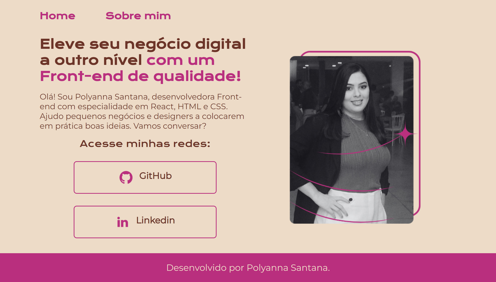

## Portfólio em HTML / CSS:

Bem-vindo meu Portfólio! 

Essa é a implementaçao do primeiro projeto realizado no curso da Alura (maior comunidade de tecnologia do país).

Desenvolvimento web visualização em desktop.

## Layout desenvolvido pela Alura e disponibilizada no Figma, com adaptações feitas por mim. 

## Conheça o aplicativo clicando no link do projeto anterior
https://polysaantana.github.io/alura-portfolio-tarefa1/

## Conheça o aplicativo clicando no link do projeto atual
https://polysaantana.github.io/alura-portfolio-tarefa2-atualiza-o/

  

### Ferramentas utilizadas: 

* Figma

* Canva

* Vscode

 

### Tecnologias:

* HTML

* CSS

### Autora:
<table>
  <tbody>
    <tr>
	    <td align="center" valign="top">  <a href="https://github.com/polysaantana"> 
            
Polyanna
 </a>
      </td>
      </td>
    </tr>
  </tbody>
</table>
